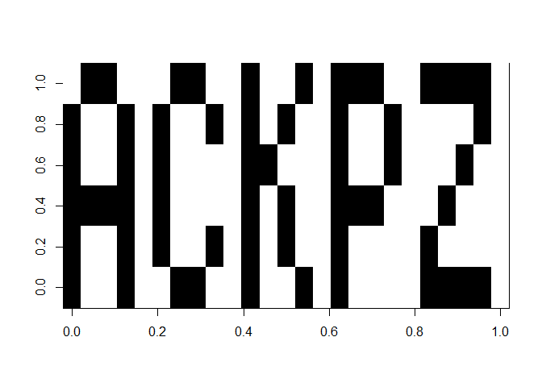

### Day 1

``` r
fuel_needed <- function(x, include_fuel_weight = FALSE) {
  fuel <- x %/% 3 - 2
  if(!include_fuel_weight) return(fuel)
  if(fuel <= 0) return(0)
  fuel + fuel_needed(fuel, include_fuel_weight)
}

fuel_needed <- Vectorize(fuel_needed, "x")

# I/O
x <- scan("inputs/1.txt")
sum(fuel_needed(x)) # Solution to Part 1
```

    ## [1] 3368364

``` r
sum(fuel_needed(x, include_fuel_weight = TRUE)) # Solution to Part 2
```

    ## [1] 5049684

### Day 2

``` r
run_program <- function(x, i = 1) {
  opcode <- x[i]                 # operator code
  if(opcode == 99) return(x)     # halting condition
  op <- switch(opcode, `+`, `*`) # operator to use
  e1 <- x[i + 1] + 1             # location of 1st element to operate on
  e2 <- x[i + 2] + 1             # location of 2nd element to operate on
  si <- x[i + 3] + 1             # location to store result
  x[si] <- op(x[e1], x[e2])      # overwrite entry
  run_program(x, i + 4)          # recurse
}

run_w_input <- function(x, noun, verb) {
  x[2:3] <- c(noun, verb)
  run_program(x)[1]
}

run_w_input <- Vectorize(run_w_input, c("noun", "verb"))

find_all_possible_outputs <- function(x) {
  df <- expand.grid(noun = 0:99, verb = 0:99)         # DF of valid inputs
  df$output <- run_w_input(program, df$noun, df$verb) # Iterate over inputs
  df
}

find_inputs_to_gen_target <- function(x, target) {
  df <- find_all_possible_outputs(x)
  df[df$output == target, ]
}

puzzle_output <- function(noun, verb) 100 * noun + verb

# I/O
program <- scan("inputs/2.txt", sep = ",")
target_output <- 19690720

# Solution to Part 1
run_w_input(program, 12, 2)
```

    ## [1] 5534943

``` r
# Solution to Part 2
inputs <- find_inputs_to_gen_target(program, target_output)
puzzle_output(inputs$noun, inputs$verb)
```

    ## [1] 7603

### Day 3

``` r
parse_instructions <- function(x) {
  x <- strsplit(x, ",")[[1]]
  data.frame(
    direction = substr(x, 1, 1),
    steps = as.integer(substring(x, 2)),
    stringsAsFactors = FALSE
  )
}

move <- function(position, direction, steps) {
  switch(
    direction,
    "L" = c(position[1] - steps, position[2]),
    "R" = c(position[1] + steps, position[2]),
    "D" = c(position[1], position[2] - steps),
    "U" = c(position[1], position[2] + steps),
  )
}

get_coordinates <- function(path) {
  output_path <- Reduce(
    f = function(position, i) move(position, path$direction[i], path$steps[i]),
    x = seq_len(nrow(path)),
    init = c(0, 0),
    accumulate = TRUE
  )
  df <- do.call(rbind, output_path)
  df <- as.data.frame(df)
  names(df) <- c("x", "y")
  df
}

trace_path <- function(x1, y1, x2, y2) {
  data.frame(x = seq(x1, x2), y = seq(y1, y2))
}

get_full_path <- function(path) {
  out <- lapply(
    seq_len(nrow(path) - 1),
    function(i) trace_path(path$x[i], path$y[i], path$x[i + 1], path$y[i + 1])
  )
  do.call(rbind, out)
}

find_crossovers <- function(full_paths) {
  coord_tuples <- lapply(full_paths, function(x) split(x, sort(as.numeric(rownames(x)))))
  crossovers <- intersect(coord_tuples[[1]], coord_tuples[[2]])
  crossovers <- do.call(rbind, crossovers)
  crossovers$dist <- abs(crossovers$x) + abs(crossovers$y)
  crossovers
}

add_total_steps_taken <- function(full_path) {
  full_path$steps <- cumsum(c(0, abs(diff(full_path$x)) + abs(diff(full_path$y))))
  full_path
}

steps_taken_to_crossover <- function(full_path, crossovers) {
  mapply(function(x, y) full_path$steps[full_path$x == x & full_path$y == y],
         crossovers$x, crossovers$y)
}

find_total_steps_taken_to_crossovers <- function(full_paths, crossovers) {
  steps_taken <- data.frame(
    path_1 = steps_taken_to_crossover(full_paths[[1]], crossovers),
    path_2 = steps_taken_to_crossover(full_paths[[2]], crossovers)
  )
  steps_taken$total <- steps_taken$path_1 + steps_taken$path_2
  steps_taken
}

# I/O
instructions <- readLines("inputs/3.txt")
instructions <- lapply(instructions, parse_instructions)
coordinates  <- lapply(instructions, get_coordinates)
full_paths   <- lapply(coordinates, get_full_path)
crossovers   <- find_crossovers(full_paths)
full_paths   <- lapply(full_paths, add_total_steps_taken)
steps_taken  <- find_total_steps_taken_to_crossovers(full_paths, crossovers)

sort(crossovers$dist)[2]   # Answer to Part 1
```

    ## [1] 2193

``` r
sort(steps_taken$total)[2] # Answer to Part 2
```

    ## [1] 63526

``` r
# Plot of wiring
rng <- range(c(full_paths[[1]][, -3], full_paths[[2]][, -3]))
plot(NA, NA, xlim = rng, ylim = rng, xlab = "", ylab = "")
lines(coordinates[[1]], type = "s", col = "blue")
lines(coordinates[[2]], type = "s", col = "red")
points(crossovers)
```


### Day 4

``` r
has_group_of_adj_digits         <- function(x) any(rle(x)$length >= 2)
has_digits_in_order             <- function(x) all(order(x) == 1:6)
has_group_of_adj_digits_len_two <- function(x) any(rle(x)$length == 2)

# I/O
x <- as.character(265275:781584)
x <- strsplit(x, "")
x <- x[sapply(x, has_group_of_adj_digits)]
x <- x[sapply(x, has_digits_in_order)]
y <- x[sapply(x, has_group_of_adj_digits_len_two)]

length(x) # Answer to Part 1
```

    ## [1] 960

``` r
length(y) # Answer to Part 2
```

    ## [1] 626

### Day 5

``` r
run_program <- function(x, input, i = 1) {

  jump_i <- i
  opcode_pars <- x[i]
  opcode <- opcode_pars %% 100
  if(opcode == 99) return(TRUE) # Base case

  instruction <- switch(opcode,
    function(e1, e2, e3) {x[e3 + 1] <- e1 + e2; x},        # Addition
    function(e1, e2, e3) {x[e3 + 1] <- e1 * e2; x},        # Multiplication
    function(e1)         {x[e1 + 1] <- input; x},          # Input
    function(e1)         {cat(e1, "\n"); x},               # Output
    function(e1, e2)     {if( e1) {jump_i <<- e2 + 1}; x}, # Jump-if-true
    function(e1, e2)     {if(!e1) {jump_i <<- e2 + 1}; x}, # Jump-if-false
    function(e1, e2, e3) {x[e3 + 1] <- e1 <  e2; x},       # Less than
    function(e1, e2, e3) {x[e3 + 1] <- e1 == e2; x}        # Equals
  )

  # Get parameter lengths and names
  n      <- length(formals(instruction))
  params <- structure(x[seq_len(n) + i], names = formalArgs(instruction))

  # Parse parameter modes
  parmodes <- floor(opcode_pars / 10 ^ (seq_len(n) + 1)) %% 10

  # Write operations always use immediate mode for write parameter
  if(!opcode %in% 4:6) parmodes[length(parmodes)] <- 1

  # Fetch parameters using given parameter modes
  params <- lapply(seq_along(params),
                   function(j) if(parmodes[j]) params[j] else x[params[j] + 1])

  # Run instruction with given parameters
  x <- do.call(instruction, params)

  # Move pointer to position given by either jump instruction or by param length
  i <- if(jump_i != i) jump_i else i + n + 1

  run_program(x, input, i)
}

x <- scan("inputs/5.txt", sep = ",")
y <- run_program(x, input = 1) # Solution to Part 1
```

    ## 0 
    ## 0 
    ## 0 
    ## 0 
    ## 0 
    ## 0 
    ## 0 
    ## 0 
    ## 0 
    ## 14522484

``` r
y <- run_program(x, input = 5) # Solution to Part 2
```

    ## 4655956

### Day 6

``` r
construct_tree <- function(tree) {
  parse_tree <- function(node, x) {
    children <- sapply(tree, function(i) i[1] == node)
    children_names <- sapply(tree[children], function(n) n[2])
    if(is.null(children)) return(node)
    c(node, lapply(children_names, function(n) parse_tree(n, x[[!children]])))
  }
  parse_tree
}

count_orbits <- function(node, count = 0) {
  t <- tail(node, -1)
  if(!length(t)) return(count)
  count + sum(sapply(t, count_orbits, count = count + 1))
}

make_df <- function(x) {
  df <- as.data.frame(do.call(rbind, x), stringsAsFactors = FALSE)
  names(df) <- c("to", "from")
  df
}

get_path <- function(df, from, to) {
  new_to <- df[df$from == from, "to"]
  if(new_to == to) return(from)
  c(from, get_path(df, new_to, to))
}

get_shortest_path <- function(df, n1, n2) {
  n1_com <- get_path(df, n1, "COM") # Path from node 1 to root node
  n2_com <- get_path(df, n2, "COM") # Path from node 2 to root node

  common_anc <- intersect(n1_com, n2_com)[1] # Find 1st common ancestor

  n1_ca <- get_path(df, n1, common_anc) # Path from node 1 to common ancestor
  n2_ca <- get_path(df, n2, common_anc) # Path from node 2 to common ancestor

  c(n1_ca, common_anc, rev(n2_ca)) # Concatenated path
}

# I/O
x <- strsplit(readLines("inputs/6.txt"), ")")
tree <- construct_tree(x)("COM", x)
count_orbits(tree) # Answer to Part 1
```

    ## [1] 241064

``` r
you_san <- get_shortest_path(make_df(x), "YOU", "SAN")
length(you_san) - 3 # Answer to Part 2
```

    ## [1] 418

### Day 7

### Day 8

``` r
get_layers <- function(x, height, width) {
  n <- height
  m <- width
  k <- n*m
  j <- length(x) %/% k
  lapply(1:j, function(i) matrix(x[((i-1)*k + 1):(j*k)], n, m, TRUE))
}

parse_data <- function(filename, height, width) {
  x <- readLines(filename)
  x <- as.numeric(strsplit(x, "")[[1]])
  get_layers(x, height, width)
}

n_dig_in_layer <- function(l, d) sum(l == d)

layer_w_fewest_0s <- function(x) {
  n_0s_in_layer <- sapply(x, n_dig_in_layer, d = 0)
  x[[order(n_0s_in_layer)[1]]]
}

`%add_color%` <- function(e1, e2) ifelse(e2 == 2, e1, e2)

get_final_image_matrix <- function(layers) {
  img <- Reduce(`%add_color%`, rev(layers))
  apply(img, 2, rev)
}

print_img <- function(x) {
  img <- get_final_image_matrix(x)
  image(t(img), col = c("white", "black"))
}

# I/O
x <- parse_data("inputs/8.txt", height = 6, width = 25)

l <- layer_w_fewest_0s(x)
n_dig_in_layer(l, 1) * n_dig_in_layer(l, 2) # Solution to Part 1
```

    ## [1] 1905

``` r
print_img(x) # Solution to Part 2
```


